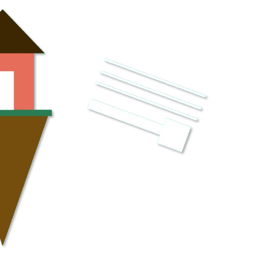

  

# Spawn Glider

**Spawn Glider** is a Mod for Minecraft Fabric (1.21.9) that allows server owners to specify regions where players can automatically glide with elytra.

## Commands

### Player Commands (No permission required)

- `/spawnglider toggle` - Toggle gliding on/off for yourself

### Admin Commands (Requires OP level 2)

- `/spawnglider zone set <minX> <minY> <minZ> <maxX> <maxY> <maxZ>` - Set a flight zone in current dimension
- `/spawnglider zone remove` - Remove flight zone from current dimension
- `/spawnglider zone list` - List all configured zones
- `/spawnglider zone info` - Show zone info for current dimension
- `/spawnglider zone sethere <radius>` - Set zone around your position
- `/spawnglider zone` - Show help for zone commands

## Requirements

- Minecraft 1.21.9
- Fabric Loader
- Fabric API

